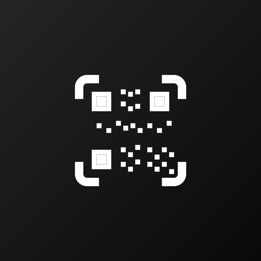

# QR Сканер

<div align="center">
  

  <p><strong>Android-приложение для быстрого сканирования, распознавания и создания QR-кодов.</strong></p>

  <p>
    
    
    
    
  </p>
</div>

## Что умеет приложение

- Сканирует QR-коды через камеру с живым предпросмотром и подсветкой найденного кода.
- Распознает QR-коды с изображений из галереи.
- Автоматически определяет тип содержимого: текст, ссылка, телефон, SMS, email, Wi-Fi, контакт, адрес, событие календаря и геопозиция.
- Показывает понятную карточку результата и предлагает подходящие действия: открыть ссылку, позвонить, отправить SMS/email, скопировать данные, открыть карту и т.д.
- Сохраняет историю сканирований локально в Room Database.
- Поддерживает поиск по истории, избранное и удаление записей.
- Генерирует QR-коды из введенных данных, быстрых шаблонов и структурированных форматов.
- Позволяет сохранить созданный QR-код в галерею или поделиться им как PNG.

## Стек

- Kotlin
- Android Gradle Plugin
- Jetpack Compose + Material 3
- Navigation Compose
- CameraX
- Google ML Kit Barcode Scanning
- ZXing
- Room
- Coroutines / Flow
- Robolectric, JUnit, Roborazzi

## Требования

- Android Studio с поддержкой Gradle 9.x.
- JDK 11 или новее.
- Android SDK:
  - `minSdk`: 24
  - `targetSdk`: 36
  - `compileSdk`: 36.1
- Устройство или эмулятор с камерой для полноценной проверки сканера.

## Быстрый запуск

1. Откройте проект в Android Studio.
2. Дождитесь синхронизации Gradle.
3. Выберите модуль `app`.
4. Запустите debug-сборку на устройстве или эмуляторе.
5. При первом запуске разрешите доступ к камере.

Запуск из терминала:

```powershell
.\gradlew.bat :app:assembleDebug
```

Готовый APK после сборки:

```text
app/build/outputs/apk/debug/app-debug.apk
```

## Команды разработки

```powershell
# Unit-тесты
.\gradlew.bat :app:testDebugUnitTest

# Debug APK
.\gradlew.bat :app:assembleDebug

# Release APK
.\gradlew.bat :app:assembleRelease
```

## Конфигурация

Для release-подписи используйте локальный `local.properties` или переменные окружения:

```properties
release.storeFile=../my-release-key.jks
release.storePassword=YOUR_STORE_PASSWORD
release.keyAlias=upload
release.keyPassword=YOUR_KEY_PASSWORD
```

Альтернатива через окружение:

```powershell
$env:KEYSTORE_PATH="C:\path\to\release-key.jks"
$env:STORE_PASSWORD="..."
$env:KEY_ALIAS="upload"
$env:KEY_PASSWORD="..."
.\gradlew.bat :app:assembleRelease
```

## Структура проекта

```text
.
├── app/
│   ├── src/main/java/com/example/
│   │   ├── camera/          # Анализ кадров CameraX и ML Kit
│   │   ├── data/            # Room Database, DAO, репозиторий истории
│   │   ├── qr/              # Распознавание типов QR, действия и генерация payload
│   │   ├── ui/              # Compose-экраны, компоненты и тема
│   │   ├── MainActivity.kt  # Навигация приложения
│   │   └── ScanApplication.kt
│   ├── src/test/            # Unit/Robolectric/Roborazzi тесты
│   └── build.gradle.kts
├── gradle/
│   ├── libs.versions.toml   # Версии зависимостей
│   └── wrapper/
├── rustore/                 # Публикационные артефакты и иконка
├── .env.example
├── build.gradle.kts
└── settings.gradle.kts
```
